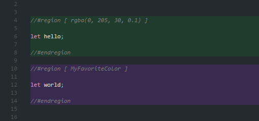
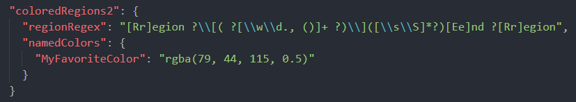
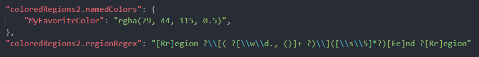
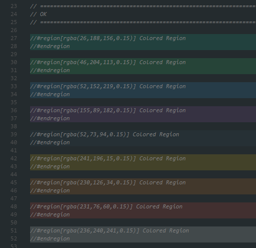
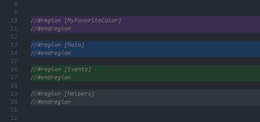
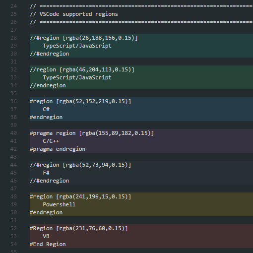

# Colored Regions 2 for Visual Studio Code

This package provides a simple way of colorizing regions.

 

# Features

Customize your regions by providing a `rgba(r, g, b, a)` color, or create a custom `named color` in **user settings** or **package.json** (workspace) and use it.

The extension now allows you to define your own `custom regex` for detecting regions, meaning you can customize the region coloring to your own needs.

 

# Settings

Settings will be read from (listed by priority):

1) package.json (workspace)

    

2) user settings

    

 

# Examples

